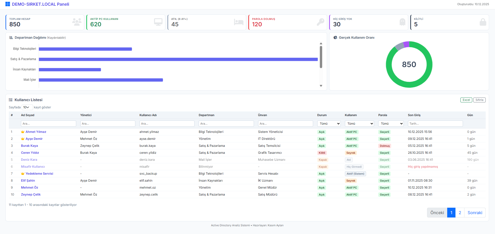

# 📊 Active Directory Analysis Dashboard

An automated PowerShell tool that audits Active Directory environments to detect security risks, stale accounts, and inventory statistics without requiring third-party licenses.



## 🚀 Features

* **🕵️‍♂️ Stale Account Detection:** Identifies accounts that haven't logged in for 6+ months (Potential security risk).
* **🖥️ Real Active User Tracking:** Distinguishes between "Enabled" accounts and users who actually logged in within the last 60 days.
* **👑 Admin Discovery:** Detects users with 'Domain Admin' privileges (checks nested groups and PrimaryGroupID).
* **🔑 Security Auditing:** Lists accounts with expired passwords or locked statuses.
* **📊 Interactive Dashboard:** Generates a standalone HTML report with searchable tables, filtering options, and charts (Chart.js).
* **🌍 Smart Search:** Includes Turkish character normalization (e.g., search 'gumus' finds 'Gümüş').

## 🛠️ Requirements

* Windows OS with PowerShell 5.1 or later.
* Active Directory Module for PowerShell (RSAT) installed.
* No external API or internet connection required.

## 📦 How to Use

1.  Download the `AD-Analysis-Dashboard.ps1` script from this repository.
2.  Run PowerShell as **Administrator** (or with a domain user account).
3.  Execute the script:
    ```powershell
    .\AD-Analysis-Dashboard.ps1
    ```
4.  The script will analyze your AD and automatically open the generated HTML report in your default browser.

## 📷 Report Details

The dashboard provides a "Lansweeper-like" overview of your infrastructure:
* **Top Cards:** Quick stats on Total, Active, Stale, and Admin accounts.
* **Charts:** Department distribution and real usage ratios.
* **Data Table:** Filterable list with "Smart Search" functionality.

## 📝 License

This project is open-source and available under the MIT License.

---
**Author:** [Kasim Aytan](https://github.com/aytan53)
